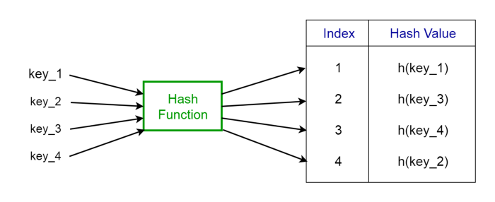
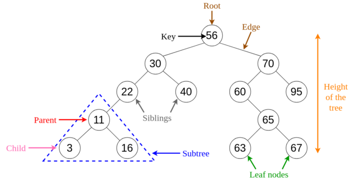

# 8 Common Data Structures every Programmer must know

**Data Structures** are a specialized means of organizing and storing data in computers in such a way that we can perform operations on the stored data more efficiently. Data structures have a wide and diverse scope of usage across the fields of Computer Science and Software Engineering.


Data structures are being used in almost every program or software system that has been developed. Moreover, data structures come under the fundamentals of Computer Science and Software Engineering. It is a key topic when it comes to Software Engineering interview questions. Hence as developers, we must have good knowledge about data structures.
In this article, I will be briefly explaining 8 commonly used data structures every programmer must know.
___________________

##1. Arrays

An **array** is a structure of fixed-size, which can hold items of the same data type. It can be an array of integers, an array of floating-point numbers, an array of strings or even an array of arrays (such as 2-dimensional arrays). Arrays are indexed, meaning that random access is possible.


###### Fig 1. Visualization of basic Terminology of Arrays
_____________

##### Array operations
- Traverse: Go through the elements and print them.
- Search: Search for an element in the array. You can search the element by its value or its index
- Update: Update the value of an existing element at a given index

**Inserting** elements to an array and **deleting** elements from an array cannot be done straight away as arrays are fixed in size. If you want to insert an element to an array, first you will have to create a new array with increased size (current size + 1), copy the existing elements and add the new element. The same goes for the deletion with a new array of reduced size.

##### Applications of arrays
- Used as the building blocks to build other data structures such as array lists, heaps, hash tables, vectors and matrices.
- Used for different sorting algorithms such as insertion sort, quick sort, bubble sort and merge sort.

```python
class Array(object):
    ''' sizeOfArray: denotes the total size of the array to be initialized
       arrayType: denotes the data type of the array(as all the elements of the array have same data type)
       arrayItems: values at each position of array
    '''
    def __init__(self, sizeOfArray, arrayType = int):
        self.sizeOfArray = len(list(map(arrayType, range(sizeOfArray))))
        self.arrayItems =[arrayType(0)] * sizeOfArray    # initialize array with zeroes
        self.arrayType = arrayType

    def __str__(self):
        return ' '.join([str(i) for i in self.arrayItems])

    def __len__(self):
        return len(self.arrayItems)

    # magic methods to enable indexing
    def __setitem__(self, index, data):
        self.arrayItems[index] = data

    def __getitem__(self, index):
        return self.arrayItems[index]

    # function for search
    def search(self, keyToSearch):
        for i in range(self.sizeOfArray):
            if (self.arrayItems[i] == keyToSearch):      # brute-forcing
                return i                                 # index at which element/ key was found

        return -1                                        # if key not found, return -1
    
    # function for updating an element at a specific index
    def update(self, keyToUpdate, position):
        if(self.sizeOfArray > position):
            self.arrayItems[position] = keyToUpdate
        else:
            print('Array size is:', self.sizeOfArray)
    
    # function to traverse an array
    def traverse(self):
        for arrayItem in self.arrayItems:
            print(arrayItem)

    # function for inserting an element
    def insert(self, keyToInsert, position):
        if(self.sizeOfArray > position):
            for i in range(self.sizeOfArray - 2, position - 1, -1):
                self.arrayItems[i + 1] = self.arrayItems[i]
            self.arrayItems[position] = keyToInsert
        else:
            print('Array size is:', self.sizeOfArray)

    # function to delete an element
    def delete(self, position):
        if(self.sizeOfArray > position):
            for i in range(position, self.sizeOfArray - 1):
                self.arrayItems[i] = self.arrayItems[i + 1]
            self.arrayItems[i + 1] = self.arrayType(0)
        else:
            print('Array size is:', self.sizeOfArray)

if __name__ == '__main__':
    a = Array(10, int)
    print(len(a))
    a.insert(2, 2)
    a.traverse()
    a.insert(3, 1)
    a.traverse()
    a.insert(4,7)
    a.traverse()
    a.delete(7)
    a.traverse()
    a.update(2, 0)
    a.traverse()
    print(len(a))
```

- **Module:** [Arrays.py](Arrays/Arrays.py)
- **Jupyter Notebook:** [Arrays.ipynb](Arrays/Arrays.ipynb)
 
___________________

##1a. Lists

**Lists** are pretty simple data structures. It’s structure keeps track of sequence of items.

```
It’s a collection of items (called nodes) ordered in a linear sequence.
```

###### These nodes don’t need to be allocated next to each other in the memory like an array is.

There is a general theoretical programming concept of a list, and there is the specific implementation of a list data structure, which may have taken this basic list idea and added a whole bunch of functionality. Lists are implemented either as linked lists (singly, doubly, circular, …) or as dynamic array.

#### An Array Vs A List
A **list** is a different kind of data structure from an **array**.
The biggest difference is in the idea of direct access Vs sequential access. Arrays allow both; direct and sequential access, while lists allow only sequential access. And this is because the way that these data structures are stored in memory.
The structure of the list doesn’t support numeric index like an array is.

- **Jupyter Notebook:** [Lists.ipynb](Lists/Lists.ipynb)

___________________

##2. Linked Lists

A **linked list** is a sequential structure that consists of a sequence of items in linear order which are linked to each other. Hence, you have to access data sequentially and random access is not possible. Linked lists provide a simple and flexible representation of dynamic sets.
Let’s consider the following terms regarding linked lists. You can get a clear idea by referring to Figure 2.

- Elements in a linked list are known as nodes.
- Each node contains a key and a pointer to its successor node, known as next.
- The attribute named head points to the first element of the linked list.
- The last element of the linked list is known as the tail.


###### Fig 2. Visualization of basic Terminology of Linked Lists
_____________

##### Following are the various types of linked lists available.
- Singly linked list — Traversal of items can be done in the forward direction only.
- Doubly linked list — Traversal of items can be done in both forward and backward directions. Nodes consist of an additional pointer known as prev, pointing to the previous node.
- Circular linked lists — Linked lists where the prev pointer of the head points to the tail and the next pointer of the tail points to the head.

##### Linked list operations
- Search: Find the first element with the key k in the given linked list by a simple linear search and returns a pointer to this element
- Insert: Insert a key to the linked list. An insertion can be done in 3 different ways; insert at the beginning of the list, insert at the end of the list and insert in the middle of the list.
- Delete: Removes an element x from a given linked list. You cannot delete a node by a single step. A deletion can be done in 3 different ways; delete from the beginning of the list, delete from the end of the list and delete from the middle of the list.

##### Applications of linked lists
- Used for symbol table management in compiler design.
- Used in switching between programs using Alt + Tab (implemented using Circular Linked List).

###### Singly Linked List
- **Module:** [SinglyLinkedList.py](Linked_Lists/SinglyLinkedList.py)
- **Jupyter Notebook:** [Linked Lists.ipynb](Linked_Lists/Linked Lists.ipynb)

###### Doubly Linked List
- **Module:** [SinglyLinkedList.py](Linked_Lists/DoublyLinkedList.py)
- **Jupyter Notebook:** [Linked Lists.ipynb](Linked_Lists/Linked Lists.ipynb)

###### Cicular Linked List
- **Module:** [circular_linked_list.py](Linked_Lists/circular_linked_list.py)

___________________

##3. Stacks

A **stack** is a **LIFO** (Last In First Out — the element placed at last can be accessed at first) structure which can be commonly found in many programming languages. This structure is named as “stack” because it resembles a real-world stack — a stack of plates.


##### Stack operations
Given below are the 2 basic operations that can be performed on a stack. Please refer to Figure 3 to get a better understanding of the stack operations.
- Push: Insert an element on to the top of the stack.
- Pop: Delete the topmost element and return it.

###### Fig 3. Visualization of basic Operations of Stacks
_____________

Furthermore, the following additional functions are provided for a stack in order to check its status.
- Peek: Return the top element of the stack without deleting it.
- isEmpty: Check if the stack is empty.
- isFull: Check if the stack is full.

##### Stack Implementation
A stack can be easily implemented either using an array or a linked list.

##### Stacks Vs Arrays Vs Linked Lists
Working with stack is simpler than working with arrays or linked lists, because there is less you can do with a stack.

This is an intentionally limited, an intentionally restricted data structure. All we do is push and pop and maybe peek. And if you’re trying to do anything else with this stack, you’re using the wrong data structure.

##### Applications of stacks
- Used for expression evaluation (e.g.: shunting-yard algorithm for parsing and evaluating mathematical expressions).
- Used to implement function calls in recursion programming.

- **Module:** [Stack.py](Stack/Stack.py)
- **Jupyter Notebook:** [Stack.ipynb](Stack/Stack.ipynb)
 
___________________

##4. Queues

A **queue** is a **FIFO** (First In First Out — the element placed at first can be accessed at first) structure which can be commonly found in many programming languages. This structure is named as “queue” because it resembles a real-world queue — people waiting in a queue.


##### Queue operations
Given below are the 2 basic operations that can be performed on a queue. Please refer to Figure 4 to get a better understanding of the queue operations.
- Enqueue: Insert an element to the end of the queue.
- Dequeue: Delete the element from the beginning of the queue.

###### Fig 4. Visualization of Basic Operations of Queues
_____________

Furthermore, the following additional functions are provided for a stack in order to check its status.
- Peek: Return the front element of the queue without deleting it.
- isEmpty: Check if the queue is empty.
- isFull: Check if the queue is full.

##### Queue Implementation
As with stacks, a queue can be implemented either using an array or a linked list.

##### Applications of queues
- Used to manage threads in multithreading.
- Used to implement queuing systems (e.g.: priority queues).

- **Module:** [Queue.py](Queue/Queue.py)
- **Jupyter Notebook:** [Queue.ipynb](Queue/Queue.ipynb)
 
##### Special Types of queues

######4a. Priority Queues
Some languages offer a version of a queue, called a **priority queue**. This allows you to arrange elements in the queue based on their priority.
```
It’s a queue, where items with higher priority step ahead of items with lower priority in the queue.
```

##### How Priority Queues Works
When you add items that have the same priority, they will queue as normal in a first in, first out order. If something comes along with a higher priority, then it will go ahead of them in the queue.

##### Defining The Priority
You can define based on what an element has higher, lower, or equal priority. This done by implementing a comparator or a compare function (as when sorting arrays), where you provide your own logic for comparing the priority between elements.

- **Module:** [PriorityQueue.py](Queue/PriorityQueue.py)
- **Jupyter Notebook:** [Queue.ipynb](Queue/Queue.ipynb)

######4b. Deque (Double-ended queue)
The deque, pronounced “DEK”, is used when we want to leverage the power of the queue and the stack, where you can add or remove from start or end.
```
It’s a queue and a stack at the same time.
```

- **Module:** [Deque.py](Queue/Deque.py)
- **Jupyter Notebook:** [Queue.ipynb](Queue/Queue.ipynb)

######4c. Circular Queue
The **circular queue** is a linear data structure in which the operations are performed based on **FIFO** (First In First Out) principle and the last position is connected back to the first position to make a circle. It is also called **"Ring Buffer"**.

One of the benefits of the circular queue is that we can make use of the spaces in front of the queue. In a normal queue, once the queue becomes full, we cannot insert the next element even if there is a space in front of the queue. But using the circular queue, we can use the space to store new values.

- **Module:** [CircularQueue.py](Queue/CircularQueue.py)
- **Jupyter Notebook:** [Queue.ipynb](Queue/Queue.ipynb)
- **Resources:**
https://leetcode.com/problems/design-circular-queue/

___________________

##5. Hash Tables ( AKA Associative Arrays or Dictionaries )

A **Hash Table** is a data structure that stores values which have keys associated with each of them. Furthermore, it supports lookup efficiently if we know the key associated with the value. Hence it is very efficient in inserting and searching, irrespective of the size of the data.
Direct Addressing uses the one-to-one mapping between the values and keys when storing in a table. However, there is a problem with this approach when there is a large number of key-value pairs. The table will be huge with so many records and may be impractical or even impossible to be stored, given the memory available on a typical computer. To avoid this issue we use hash tables.

##### Hash Function
A special function named as the hash function ```(h)``` is used to overcome the aforementioned problem in direct addressing.

In direct accessing, a value with key k is stored in the slot k. Using the hash function, we calculate the index of the table (slot) to which each value goes. The value calculated using the hash function for a given key is called the hash value which indicates the index of the table to which the value is mapped.
```
h(k) = k % m
```

- h: Hash function
- k: Key of which the hash value should be determined
- m: Size of the hash table (number of slots available). A prime value that is not close to an exact power of 2 is a good choice for m.

###### Fig 5. Representation of a Hash Function
_____________

Consider the hash function ```h(k) = k % 20```, where the size of the hash table is 20. Given a set of keys, we want to calculate the hash value of each to determine the index where it should go in the hash table. Consider we have the following keys, the hash and the hash table index.
- 1 → 1%20 → 1
- 5 → 5%20 → 5
- 23 → 23%20 → 3
- 63 → 63%20 → 3

From the last two examples given above, we can see that collision can arise when the hash function generates the same index for more than one key. We can resolve collisions by selecting a suitable hash function h and use techniques such as chaining and open addressing.

##### Applications of hash tables
- Used to implement database indexes.
- Used to implement associative arrays.
- Used to implement the “set” data structure.

___________________

##6. Trees

A **tree** is a hierarchical structure where data is organized hierarchically and are linked together. This structure is different than a linked list whereas, in a linked list, items are linked in a linear order.
Various types of trees have been developed throughout the past decades, in order to suit certain applications and meet certain constraints. Some examples are binary search tree, B tree, treap, red-black tree, splay tree, AVL tree and n-ary tree.

##### Binary Search Trees
A **binary search tree (BST)**, as the name suggests, is a binary tree where data is organized in a hierarchical structure. This data structure stores values in sorted order.

Every node in a binary search tree comprises the following attributes.
1. key: The value stored in the node.
1. left: The pointer to the left child.
1. right: The pointer to the right child.
1. p: The pointer to the parent node.

A binary search tree exhibits a unique property that distinguishes it from other trees. This property is known as the binary-search-tree property.

Let x be a node in a binary search tree.
- If y is a node in the left subtree of x, then y.key ≤ x.key
- If y is a node in the right subtree of x, then y.key ≥ x.key


###### Fig 6. Visualization of Basic Terminology of Trees.
_____________

##### Applications of trees
- Binary Trees: Used to implement expression parsers and expression solvers.
- Binary Search Tree: used in many search applications where data are constantly entering and leaving.
- Heaps: used by JVM (Java Virtual Machine) to store Java objects.
- Treaps: used in wireless networking.

- **Module:** [Tree.py](Trees/Tree.py)
- **Module:** [BinarySearchTree.py](Trees/BinarySearchTree.py)
- **Jupyter Notebook:** [Tree.ipynb](Trees/Tree.ipynb)

___________________

##7. Heaps

A **Heap** is a special case of a binary tree where the parent nodes are compared to their children with their values and are arranged accordingly.
Let us see how we can represent heaps. Heaps can be represented using trees as well as arrays. Figures 7 and 8 show how we can represent a binary heap using a binary tree and an array.


###### Fig 7. Binary Tree Representation of a Heap


###### Fig 8. Array Representation of a Heap
_____________

Heaps can be of 2 types.
- Min Heap — the key of the parent is less than or equal to those of its children. This is called the min-heap property. The root will contain the minimum value of the heap.
- Max Heap — the key of the parent is greater than or equal to those of its children. This is called the max-heap property. The root will contain the maximum value of the heap.

##### Applications of heaps
- Used in heapsort algorithm.
- Used to implement priority queues as the priority values can be ordered according to the heap property where the heap can be implemented using an array.
- Queue functions can be implemented using heaps within O(log n) time.
- Used to find the kᵗʰ smallest (or largest) value in a given array.

- **Module:** [Heap.py](Heap/Heap.py)
- **Jupyter Notebook:** [Heap.ipynb](Heap/Heap.ipynb)

___________________

##8. Graphs

A **graph** consists of a finite set of **vertices** or **nodes** and a set of **edges** connecting these vertices.

The **order** of a graph is the number of vertices in the graph. The **size** of a graph is the number of edges in the graph.

Two nodes are said to be **adjacent** if they are connected to each other by the same edge.

##### Directed Graphs
A graph ```G``` is said to be a **directed graph** if all its edges have a direction indicating what is the start vertex and what is the end vertex.

We say that ```(u, v)``` is incident from or leaves vertex ```u``` and is incident to or enters vertex ```v```.

**Self-loops**: Edges from a vertex to itself.

##### Undirected Graphs
A graph ```G``` is said to be an **undirected graph** if all its edges have no direction. It can go in both ways between the two vertices.

If a vertex is not connected to any other node in the graph, it is said to be **isolated**.


###### Fig 9. Visualization of Terminology of Graphs
_____________

##### Applications of graphs
- Used to represent social media networks. Each user is a vertex, and when users connect they create an edge.
- Used to represent web pages and links by search engines. Web pages on the internet are linked to each other by hyperlinks. Each page is a vertex and the hyperlink between two pages is an edge. Used for Page Ranking in Google.
- Used to represent locations and routes in GPS. Locations are vertices and the routes connecting locations are edges. Used to calculate the shortest route between two locations.

- **Module:** [Graph.py](Graph/Graph.py)
- **Jupyter Notebook:** [Graph.ipynb](Graph/Graph.ipynb)
