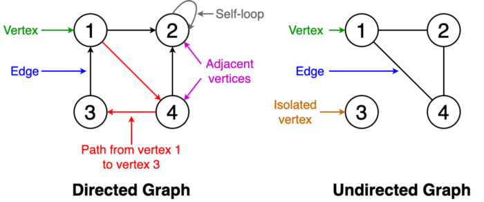

# ALGORITHMS

_____________

## Graph Algorithms

### References

- You can check out the implementations of graph algorithms found in the [networkx](https://networkx.github.io/) and [igraph](https://igraph.org/python/) python modules. 
- You can read about python-igraph in my previous article [Newbies Guide to Python-igraph](https://towardsdatascience.com/newbies-guide-to-python-igraph-4e51689c35b4).

### What is a Graph ?

A **graph** consists of a finite set of **vertices** or nodes and a set of **edges** connecting these vertices. Two vertices are said to be **adjacent** if they are connected to each other by the same edge.

Some basic definitions related to graphs are given below. You can refer to Figure 1 for examples.

- Order: The number of vertices in the graph
- Size: The number of edges in the graph
- Vertex degree: The number of edges that are incident to a vertex
- Isolated vertex: A vertex that is not connected to any other vertices in the graph
- Self-loop: An edge from a vertex to itself
- Directed graph: A graph where all the edges have a direction indicating what is the start vertex and what is the end vertex
- Undirected graph: A graph with edges that have no direction
- Weighted graph: Edges of the graph has weights
- Unweighted graph: Edges of the graph has no weights

###### Fig 1. Visualization of Terminology of Graphs

### 1. Breadth-first search

___Traversing___ or ___searching___ is one of the fundamental operations which can be performed on graphs. In **breadth-first search (BFS)**, we start at a particular vertex and explore all of its neighbours at the present depth before moving on to the vertices in the next level. Unlike trees, graphs can contain cycles (a path where the first and last vertices are the same). Hence, we have to keep track of the visited vertices. When implementing BFS, we use a queue data structure.

Figure 2 denotes the animation of a BFS traversal of an example graph. Note how vertices are discovered (yellow) and get visited (red).

###### Fig 2. Animation of BFS traversal of a graph

#### Applications
- Used to determine the shortest paths and minimum spanning trees.
- Used by search engine crawlers to build indexes of web pages.
- Used to search on social networks.
- Used to find available neighbour nodes in peer-to-peer networks such as BitTorrent.

- **Module:** [breadth_first_search.py](algorithms/graphs/breadth_first_search.py)

### 2. Depth-first search

In **depth-first search (DFS)** we start from a particular vertex and explore as far as possible along each branch before retracing back (backtracking). In DFS also we have to keep track of the visited vertices. When implementing DFS, we use a stack data structure to support backtracking.

Figure 3 denotes the animation of a DFS traversal of the same example graph used in Figure 2. Note how it traverses to the depths and backtracks.

###### Fig 3. Animation of DFS traversal of a graph

#### Applications
- Used to find a path between two vertices.
- Used to detect cycles in a graph.
- Used in topological sorting.
- Used to solve puzzles having only one solution (e.g., mazes)

- **Module:** [depth_first_search.py](algorithms/graphs/depth_first_search.py)

### 3. Shortest path

The **___shortest path___** from one vertex to another vertex is a path in the graph such that the sum of the weights of the edges that should be travelled is minimum.

Figure 4 shows an animation where the shortest path is determined from vertex 1 to vertex 6 in a graph.

###### Fig 4. Animation showing the shortest path from vertex 1 to vertex 6

#### Algorithms
1. Dijkstra’s shortest path algorithm
1. Bellman–Ford algorithm

#### Applications
- Used to find directions to travel from one location to another in mapping software like Google maps or Apple maps.
- Used in networking to solve the min-delay path problem.
- Used in abstract machines to determine the choices to reach a certain goal state via transitioning among different states (e.g., can be used to determine the minimum possible number of moves to win a game).

- **Module:** [dijkstra_algorithm.py](algorithms/graphs/dijkstra_algorithm.py)
- **Module:** [bellman_ford.py](algorithms/graphs/bellman_ford.py)

### 4. Cycle detection

A ___cycle___ is a path in a graph where the first and last vertices are the same. If we start from one vertex, travel along a path and end up at the starting vertex, then this path is a cycle. **___Cycle detection___** is the process of detecting these cycles. Figure 5 shows an animation of traversing a cycle.

###### Fig 5. A cycle

#### Algorithms
1. Floyd cycle detection algorithm
1. Brent’s algorithm

#### Applications
- Used in distributed message-based algorithms.
- Used to process large-scale graphs using a distributed processing system on a cluster.
- Used to detect deadlocks in concurrent systems.
- Used in cryptographic applications to determine keys of a message that can map that message to the same encrypted value.

- **Module:** [graphs_floyd_warshall.py](algorithms/graphs/graphs_floyd_warshall.py)

### 5. Minimum Spanning Tree

A **___minimum spanning tree___** is a subset of the edges of a graph that connects all the vertices with the minimum sum of edge weights and consists of no cycles.

Figure 6 is an animation showing the process of obtaining a minimum spanning tree.

###### Fig 6. Animation showing a minimum spanning tree

#### Algorithms
1. Prim’s algorithm
1. Kruskal’s algorithm

#### Applications
- Used to construct trees for broadcasting in computer networks.
- Used in graph-based cluster analysis.
- Used in image segmentation.
- Used in regionalisation of socio-geographic areas, where regions are grouped into contiguous regions.

- **Module:** [minimum_spanning_tree_kruskal2.py](algorithms/graphs/minimum_spanning_tree_kruskal2.py)
- **Module:** [minimum_spanning_tree_prims.py](algorithms/graphs/minimum_spanning_tree_prims.py)

### 6. Strongly connected components

A graph is said to be **___strongly connected___** if every vertex in the graph is reachable from every other vertex.

Figure 7 shows an example graph with three strongly connected components with vertices colored in red, green and yellow.

###### Fig 7. Strongly connected components

#### Algorithms
1. Kosaraju’s algorithm
1. Tarjan’s strongly connected components algorithm

#### Applications
- Used to compute the [Dulmage–Mendelsohn decomposition](https://en.wikipedia.org/wiki/Dulmage%E2%80%93Mendelsohn_decomposition), which is a classification of the edges of a bipartite graph.
- Used in social networks to find a group of people who are strongly connected and make recommendations based on common interests.

- **Module:** [scc_kosaraju.py](algorithms/graphs/scc_kosaraju.py)
- **Module:** [tarjans_scc.py](algorithms/graphs/tarjans_scc.py)

### 7. Topological sorting

**___Topological sorting___** of a graph is a linear ordering of its vertices so that for each directed edge (u, v) in the ordering, vertex u comes before v.

Figure 8 shows an example of a topological ordering of vertices (1, 2, 3, 5, 4, 6, 7, 8). You can see that vertex 5 should come after vertices 2 and 3. Similarly, vertex 6 should come after vertices 4 and 5.

###### Fig 8. A topological ordering of vertices in a graph

#### Algorithms
1. Kahn’s algorithm
1. The algorithm based on depth-first search

#### Applications
- Used in instruction scheduling.
- Used in data serialisation.
- Used to determine the order of compilation tasks to perform in makefiles.
- Used to resolve symbol dependencies in linkers.

- **Module:** [kahns_algorithm_topo.py](algorithms/graphs/kahns_algorithm_topo.py)

### 8. Graph coloring

**___Graph coloring___** assigns colors to elements of a graph while ensuring certain conditions. ___Vertex coloring___ is the most commonly used graph coloring technique. In vertex coloring, we try to color the vertices of a graph using k colors and any two adjacent vertices should not have the same color. Other coloring techniques include ___edge coloring___ and ___face coloring___.

The ___chromatic number___ of a graph is the smallest number of colors needed to color the graph.

Figure 9 shows the vertex coloring of an example graph using 4 colors.

###### Fig 9. Vertex coloring

#### Algorithms
1. Algorithms using breadth-first search or depth-first search
1. Greedy coloring

#### Applications
- Used to schedule timetable.
- Used to assign mobile radio frequencies.
- Used to model and solve games such as Sudoku.
- Used to check if a graph is bipartite.
- Used to colour geographical maps of countries or states where adjacent countries or states have different colours.

### 9. Maximum flow

We can model a graph as a flow network with edge weights as flow capacities. In the **___maximum flow problem___**, we have to find a flow path that can obtain the maximum possible flow rate.

Figure 10 shows an animated example of determining the maximum flow of a network and determining the final flow value.

###### Fig 10. Determining the maximum flow

#### Algorithms
1. Ford-Fulkerson algorithm
1. Edmonds–Karp algorithm
1. Dinic’s algorithm

#### Applications
- Used in airline scheduling to schedule flight crews.
- Used in image segmentation to find the background and the foreground in an image.
- Used to eliminate baseball teams that cannot win enough games to catch up to the current leader in their division.

- **Module:** [edmonds_karp_multiple_source_and_sink.py](algorithms/graphs/edmonds_karp_multiple_source_and_sink.py)
- **Module:** [dinic.py](algorithms/graphs/dinic.py)

### 10. Matching

A **___matching___** in a graph is a set of edges that does not have common vertices (i.e., no two edges share a common vertex). A matching is called a ___maximum matching___ if it contains the largest possible number of edges matching as many vertices as possible.

Figure 11 shows an animation of obtaining the complete matching of a bipartite graph with two sets of vertices denoted in orange and blue.

###### Fig 11. Matching of a bipartite graph

#### Algorithms
1. Hopcroft-Karp algorithm
1. Hungarian algorithm
1. Blossom algorithm

#### Applications
- Used in matchmaking to match brides and grooms (the stable marriage problem).
- Used to determine the vertex cover.
- Used in transportation theory to solve problems in resource allocation and optimization in travel.

_____________
